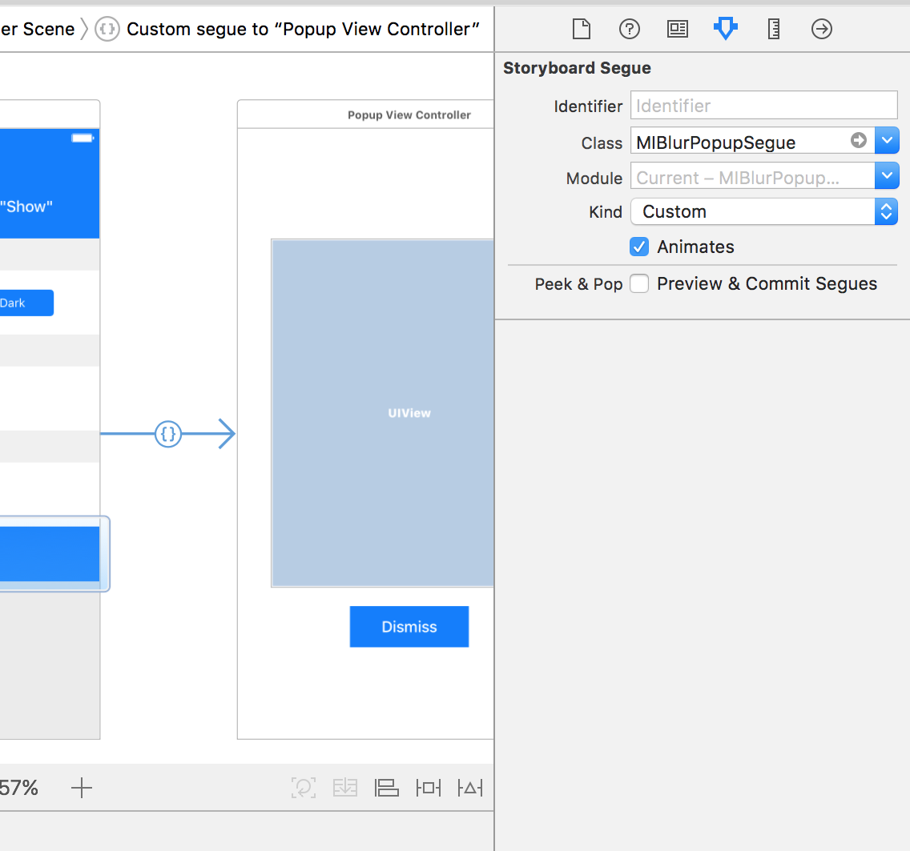

# MIBlurPopup
MIBlurPopup lets you create amazing popups with a blurred background

[](https://developer.apple.com/iphone/index.action)
[](https://developer.apple.com/swift/)


# Setup
Copy the "MIBlurPopup.swift" into your project

After made the view controller you want to present conform the protocol ```MIBlurPopupDelegate``` you can present it with a line of code:
```MIBlurPopup.show(popupViewController, on: <some view controller>)``` or, you can just set ```MIBlurPopupSegue``` as your custom segue's class like that 

# Customization
You can customize the popup behavior with the MIBlurPopupDelegate protocol
- ```popupView: UIView // the view that contains the popup```
- ```blurEffectStyle: UIBlurEffectStyle // the blur effect style you want to apply to the background```
- ```initialScaleAmmount: CGFloat // ∈(0, 1), this property will be used to calculate size that the popupView will have at the begin of the presentation and at the end of the dismiss. When != 1 it will induce a zoom-effect.```
- ```animationDuration: TimeInterval // the transitions animations duration```

#TODO
* [x] Add storyboard support (eg: with custom segue)

#Demo
In this repository you can also find a demo.

# Info
If you like this git you can follow me here or on twitter :) [@MarioIannotta](http://www.twitter.com/marioiannotta)

Cheers from Italy!
